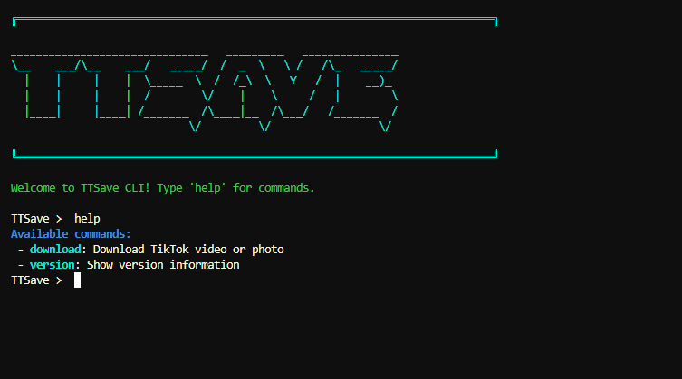

# TTSAVE - Скачивать ведь так просто 🫢

## Технологии


## Описание

TTSave упрощает процесс скачивания видео из TikTok, предоставляя удобный интерфейс для пользователей. Библиотека использует Selenium для автоматизации процесса скачивания, обеспечивая стабильность и надежность.

## Функционал TTSave
- Скачивания видео 
- Скачивания фото + аудио 

## Установка

1. Используйте pip для установки из [PyPi](https://pypi.org/project/ttsave/):

    ```bash
    pip3 install ttsave
    ```
2. Используйте pip для установки из [GitHub](https://github.com/FlacSy/ttsave/):

    ```bash
    pip3 install git+https://github.com/FlacSy/ttsave
    ```

## Требования
- Python 3.10.0
- Установленный Chrome браузер и ChromeDriver

Библиотеки перечислены в файле [requirements.txt](./requirements.txt)

## Пример использования

<details>
  <summary><h2>Пример кода</h2></summary>

```python
import os
from selenium import webdriver
from ttsave import TTSave

def main():
    url = input("TikTok URL: ")
    options = webdriver.ChromeOptions()
    download_dir = f"{os.path.dirname(os.path.abspath(__file__))}"
    downloader = TTSave(
        url=url,
        options=options,
        download_dir=download_dir,
        debug_mode=True
    )
    out = downloader.download()
    print(f"File(s): {out['files']}")
    print(f"Content type: {out['type']}")
    print(f"Content url: {out['url']}")

if __name__ == "__main__":
    main()
```

</details>

## CLI


TTSave также предоставляет удобный интерфейс командной строки (CLI) для скачивания видео из TikTok. 

### Установка

CLI устанавливается вместе с библиотекой TTSave. Используйте одну из команд установки, приведенных выше.

### Примеры использования CLI

```bash
# Запуск CLI
ttsave

# Скачивание видео по URL
ttsave download <TikTok URL> <download_dir> --debug

# Показать версию
ttsave version

# Показать справку
ttsave help
```

### Команды CLI

- `download <url> <download_dir> --debug`: Скачивание видео или фото из TikTok по указанному URL. Параметр `download_dir` является необязательным, по умолчанию используется текущая директория. Опция `--debug` включает режим отладки.
- `version`: Показать информацию о версии TTSave CLI.
- `help`: Показать доступные команды.

Если у вас возникли вопросы или проблемы, пожалуйста, откройте issue на [GitHub](https://github.com/FlacSy/ttsave/issues).